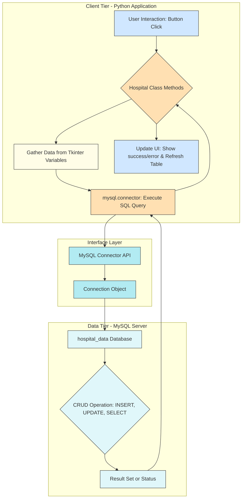

# 🏥 Hospital Management System (Tkinter & MySQL)

This project is a simple **Hospital Management System** developed using **Python's Tkinter** for the graphical user interface and **MySQL** for data persistence. It allows users to input, view, generate prescriptions, update, and delete patient and medication records.

---
## 🌟 Architectural Overview

The application follows a **Two-Tier Architecture**:

### Client Tier (Presentation & Logic)
Handled by the **Python application** using the `tkinter` library.

* **GUI:** The `Hospital` class manages all GUI elements (frames, labels, entry fields, buttons, and the Treeview for data display).
* **Application Logic:** Methods like `generate_prescription`, `clear_fields`, `on_row_selected`, and data validation are handled here.

### Data Tier (Database)
Handled by the **MySQL server**.

* **Database Connection:** The `mysql.connector` library establishes communication.
* **Data Persistence:** The application interacts with the `hospital_data` database and the `data` table to perform **CRUD** (Create, Read, Update, Delete) operations via SQL queries (`INSERT`, `SELECT`, `UPDATE`, `DELETE`).

---

### 🧱 Key Components

| Component | Technology | Role |
| :--- | :--- | :--- |
| **GUI** | `tkinter`, `ttk` | User interface design and event handling. |
| **Database Connector** | `mysql.connector` | Connects the Python application to the MySQL server. |
| **Hospital Class** | Python OOP | The core class managing UI layout, Tkinter variables, business logic, and database operations. |
| **hospital\_data** | MySQL Database | Stores all patient and prescription records. |

---
## 🛠️ Step-by-Step Setup Guide

Follow these steps to set up and run the project locally.

### Step 1: Prerequisites

Ensure you have the following installed on your system:

* **Python 3.x**
* **MySQL Server** (e.g., via XAMPP, MySQL Workbench, or a standalone installation)

### Step 2: Install Python Dependencies

You need the **MySQL Connector for Python** to interact with the database.

Open your terminal or command prompt and run:

```bash
pip install mysql-connector-python

```
---
### Step 3: Configure MySQL Database

You need to create the database and the required table.

---
#### 3.1. Database Connection Details

Before proceeding, ensure the `db_config` in the Python script is correct for your MySQL setup.

```python
        self.db_config = {
            "host": "localhost",
            "user": "root",
            "password": "yourpass", # <-- UPDATE THIS with your MySQL password
            "database": "hospital_data"
        }
```
---
#### 3.2. Create Database and Table

Open your MySQL client (Workbench, command line, etc.) and execute the following SQL commands to create the database and the required 18-column table.

**Note:** The table columns must precisely match the variables used in the Python script.

```sql
-- Create the Database
CREATE DATABASE IF NOT EXISTS hospital_data;

-- Use the newly created database
USE hospital_data;

-- Create the 'data' table (must match the 18 fields used in the Python code)
CREATE TABLE IF NOT EXISTS data (
    nameoftablets VARCHAR(255),
    ref VARCHAR(255) PRIMARY KEY, -- Using 'ref' as the unique identifier
    dose VARCHAR(255),
    nooftablets VARCHAR(255),
    lot VARCHAR(255),
    issuedate VARCHAR(255),
    expdate VARCHAR(255),
    dailydose VARCHAR(255),
    sideeffect VARCHAR(255),
    furtherInfo VARCHAR(255),
    bloodpressure VARCHAR(255),
    storageadvice VARCHAR(255),
    medication VARCHAR(255),
    patientId VARCHAR(255),
    nhsnumber VARCHAR(255),
    patientname VARCHAR(255),
    dateofbirth VARCHAR(255),
    patientaddress VARCHAR(255)
);

-- Optional: Verify the table structure
DESCRIBE data;
```
---
### Step 4: Run the Application 🚀

Save the provided Python code as a file (e.g., `hospital_app.py`) and run it from your terminal:

```bash
python hospital_app.py
```
The **Tkinter application window** should now appear, confirming the application is running successfully.

---
## 💻 Application Functionality

The application provides the following core features:

| Button | Functionality | SQL Operation |
| :--- | :--- | :--- |
| **Prescription** | Generates a formatted text prescription in the right panel based on current form data. | None |
| **Prescription Data** | Saves the data from all fields as a new record into the MySQL `data` table. | `INSERT` |
| **Update** | Modifies the existing record in the database using the **Reference No** (`ref`) field as the unique key. | `UPDATE` |
| **Delete** | Removes the record from the database based on the **Reference No** (`ref`) field. | `DELETE` |
| **Clear** | Clears the data from all input fields and the Prescription panel. | None |
| **Exit** | Closes the application window. | None |

---

### 📋 Using the Table

* The **Treeview** at the bottom automatically displays all records fetched from the database.
* The `fetch_data()` method is called upon startup and after every successful insert or update/delete operation to refresh the display.
* **Double-clicking** or selecting a row in the table triggers the `on_row_selected` method, which automatically loads that record's data back into the input fields for editing or deletion.


